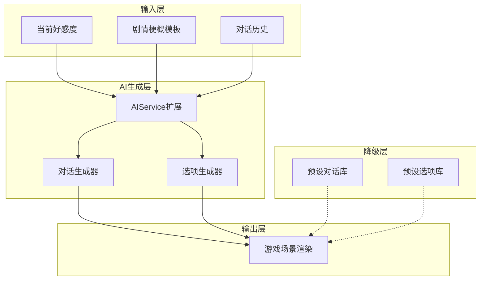

# 夏栀AI驱动剧情系统实现计划

## 核心架构



## 1. 扩展类型定义

修改 [`galgame/src/types/index.ts`](galgame/src/types/index.ts)，添加AI驱动节点类型：

```typescript
export interface AIGeneratedNode {
  id: string;
  type: 'ai_dialog' | 'ai_choice';
  characterId: CharacterId;
  background?: string;
  // 剧情梗概，用于指导AI生成
  storyContext: {
    scene: string;           // 场景描述
    event: string;           // 当前事件
    mood: string;            // 氛围
    keyPoints: string[];     // 必须包含的关键点
  };
  // 降级用的预设内容
  fallback: {
    dialogs?: DialogLine[];
    choices?: Choice[];
  };
  nextNodeId?: string;
}
```

## 2. 扩展AIService

修改 [`galgame/src/services/AIService.ts`](galgame/src/services/AIService.ts)，添加剧情生成方法：

```typescript
// 新增方法：生成AI对话
async generateStoryDialog(context: StoryContext): Promise<DialogLine[]>

// 新增方法：生成AI选项
async generateStoryChoices(context: StoryContext): Promise<Choice[]>

// 使用Gemini Flash模型加速响应
private fastModelUrl = 'gemini-2.5-flash:generateContent';
```

**关键优化**：使用 `gemini-2.5-flash` 模型而非 `gemini-pro`，响应速度更快。

## 3. 夏栀剧情梗概设计

创建 [`galgame/src/data/xia_zhi_story.ts`](galgame/src/data/xia_zhi_story.ts)：

### 第二章：动漫社的约定

- **场景**：动漫社活动室、学校天台
- **核心事件**：夏栀邀请参加动漫展
- **好感度分支**：
  - 低好感（<25）：普通社团活动，关系疏远
  - 中好感（25-50）：一起看动漫，增进了解
  - 高好感（>50）：主动邀请约会，表露心意

### 第三章：夏日祭的告白

- **场景**：夏日祭、烟火大会
- **核心事件**：夏日祭上的告白
- **结局分支**：
  - 普通结局（<40）：保持朋友关系
  - 好感结局（40-70）：成功告白
  - 完美结局（>70）：双向表白 + 隐藏剧情

## 4. 修改GameScene渲染逻辑

修改 [`galgame/src/scenes/GameScene.ts`](galgame/src/scenes/GameScene.ts)：

```typescript
// 新增AI节点处理逻辑
if (node.type === 'ai_dialog') {
  // 显示加载动画
  showLoadingIndicator();
  
  // 尝试AI生成
  const dialogs = await aiService.generateStoryDialog(node.storyContext);
  
  // 失败时使用降级内容
  if (!dialogs) {
    renderDialogs(node.fallback.dialogs);
  } else {
    renderDialogs(dialogs);
  }
}
```

## 5. 无AI降级方案

为每个AI节点准备完整的预设内容：

- 预设对话：3-5句符合场景的固定对话
- 预设选项：2-3个固定选项，覆盖正面/中立/负面反应

## 6. 响应速度优化

- 使用 `gemini-2.5-flash` 模型（响应更快）
- 设置较短的 `maxOutputTokens`（100-150）
- 添加超时控制（5秒超时自动降级）
- 预加载下一节点内容

## 实现文件清单

| 文件 | 修改内容 |

|------|----------|

| `src/types/index.ts` | 添加AI驱动节点类型定义 |

| `src/services/AIService.ts` | 添加剧情生成方法 |

| `src/data/xia_zhi_story.ts` | 新建夏栀AI剧情数据 |

| `src/data/chapters.ts` | 添加夏栀第2-3章节点 |

| `src/scenes/GameScene.ts` | 添加AI节点