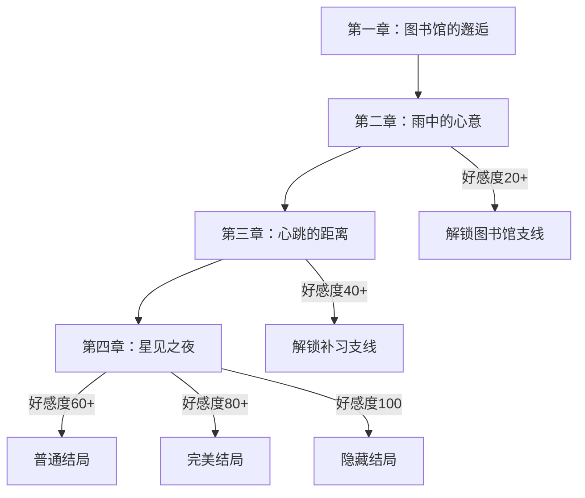

# 苏晚晴后续三章剧情设计方案

基于第一章"图书馆的邂逅"的铺垫，后续三章将围绕苏晚晴"外冷内热"的核心性格展开，通过经典场景逐步揭开她温柔的内心。

---

## 剧情架构总览

---

## 第二章：雨中的心意

**核心主题**：发现她隐藏在冷淡外表下的温柔

**情感进展**：陌生 → 熟悉 (好感度 20-40)

**关键场景**：放学后的暴雨、图书馆的角落、傍晚的操场

### 剧情大纲

1. **开场：突如其来的暴雨**

   - 放学时天降暴雨，玩家忘带伞被困在校门口
   - 苏晚晴路过，犹豫片刻后默默撑伞走向玩家
   - 关键选择：接受她的好意 / 说不用麻烦 / 开玩笑说"班长是来救我的吗"

2. **核心事件：一起避雨去图书馆**

   - 两人共撑一把伞，距离很近，她的耳尖泛红
   - 在图书馆等雨停，她推荐了一本书给玩家
   - 发现她在书里夹着的便签——写着"希望他今天过得好"
   - 关键选择：假装没看到 / 问她便签的事 / 故意逗她

3. **支线：傍晚的操场**

   - 雨停后，她主动提议去操场散步
   - 夕阳下她难得地聊起了自己——其实很羡慕能交到朋友的人
   - 关键选择：认真倾听并回应 / 开玩笑活跃气氛 / 说"我可以做你的朋友"

4. **章节结尾：暴露的温柔**

   - 分别时，她递给玩家一把折叠伞——"以防万一"
   - 玩家发现这是她唯一的备用伞
   - 自由对话节点

### 关键台词设计

> **苏晚晴**（递伞时，不看玩家）：

> "......这个，你拿着。"

> "......不是什么特别的意思，只是......你总是忘带伞。"

> （小声）"我......注意到了。"

---

## 第三章：心跳的距离

**核心主题**：距离拉近，心跳加速

**情感进展**：熟悉 → 好感 (好感度 40-60)

**关键场景**：考试周的教室、她家的书房、深夜的微信

### 剧情大纲

1. **开场：考试周的压力**

   - 期中考试临近，玩家某科成绩不理想
   - 苏晚晴主动提出帮忙补习，态度很认真但语气依然冷淡
   - 关键选择：欣然接受 / 开玩笑说"班长终于肯理我了" / 担心麻烦她

2. **核心事件：到她家学习**

   - 第一次去苏晚晴家，发现她房间很整洁，书架上满是书
   - 她泡了手冲咖啡给玩家，说"我比较擅长做这个"
   - 补习过程中，两人距离很近，她讲解时专注认真，侧脸很好看
   - 关键选择：认真学习 / 偷偷看她 / 夸她讲得好

3. **转折：意外的亲近**

   - 玩家打瞌睡时不小心靠在了她肩上
   - 她僵住了，但没有推开，而是轻轻调整姿势让玩家靠得更舒服
   - 关键选择：（醒来后）假装什么都不知道 / 道歉 / 说"你的肩膀很舒服"

4. **支线：深夜的微信**

   - 晚上收到她的微信："......今天学的内容，有不懂的地方吗"
   - 聊着聊着，话题从学习变成了日常
   - 她发来一张窗外月亮的照片："......今晚的月亮很漂亮"
   - 自由对话节点

5. **章节结尾：考试后的惊喜**

   - 考试成绩出来，玩家进步明显
   - 她难得地笑了："......我就知道你可以的"
   - 悄悄塞给玩家一个小礼物——一个她亲手做的书签

### 关键台词设计

> **苏晚晴**（深夜微信）：

> "......其实，我很少和别人聊这么久。"

> "大家都觉得我很难接近......你是第一个不这么觉得的人。"

> "......谢谢你。"

---

## 第四章：星见之夜

**核心主题**：告白与羁绊

**情感进展**：好感 → 喜欢/深爱 (好感度 60-100)

**关键场景**：文化祭、天台、星空下

### 剧情大纲

1. **开场：文化祭筹备**

   - 学校文化祭，班级要准备咖啡厅
   - 苏晚晴负责统筹，工作量很大但从不抱怨
   - 关键选择：主动帮忙 / 在一旁看着 / 偷偷帮她分担

2. **核心事件：天台的秘密**

   - 发现苏晚晴独自在天台休息，看起来很疲惫
   - 她第一次在玩家面前展露脆弱："......有时候会觉得，做班长很累"
   - 关键选择：安慰她 / 陪她一起沉默 / 说"以后有我帮你"

3. **高潮：星空下的告白（多分支）**

**分支A：玩家主动告白**

   - 文化祭结束后，玩家约她去操场
   - 星空下，鼓起勇气说出心意
   - 她愣住，然后低头，耳尖通红
   - "......你是认真的吗？......我、我也......"

**分支B：她的告白**

   - 好感度足够高时，她会主动约玩家去天台
   - 犹豫很久后，她递出一个信封
   - 里面是一封信，写满了从第一天相遇以来的心情
   - "......我不擅长说话，所以......写下来了"

4. **结局分支**

**普通结局（好感度60-79）**：

   - 成为恋人，日常甜蜜
   - 她开始会主动牵手，虽然还是会害羞
   - 结局CG：两人在图书馆并肩看书

**完美结局（好感度80-99）**：

   - 她带玩家见了家人
   - 送给玩家一本亲手做的相册，记录了所有美好回忆
   - 结局CG：樱花树下，她踮脚亲吻玩家脸颊

**隐藏结局（好感度100 + 全支线完成）**：

   - 跨年夜，两人一起在天台看烟花
   - 她说出了藏在心里很久的话："......遇见你，是我人生最幸运的事"
   - 结局CG：烟花绽放的瞬间，两人相拥

### 关键台词设计

> **苏晚晴**（告白时）：

> "......我知道，我不是那种会讨人喜欢的女生。"

> "我不会撒娇，不会说甜言蜜语，连笑都很少......"

> "但是......如果是你的话......"

> （抬头，眼眶微红）"我想试着，变得更温柔一点。"

---

## 技术实现要点

1. **文件修改**：在 [src/data/chapters.ts](galgame/src/data/chapters.ts) 中添加三个新章节
2. **节点数量**：每章约 15-20 个对话节点 + 5-8 个选择节点
3. **好感度设计**：

   - 正确选择：+5 至 +10
   - 中立选择：+1 至 +3
   - 错误选择：-3 至 -8

4. **自由对话节点**：每章结尾设置，使用 `free_chat` 类型
5. **背景切换**：需要新增 `library`、`rooftop`、`home` 等背景

---

## 剧情特色

| 章节 | 核心场景 | 情感转折点 | 苏晚晴的变化 |

|------|----------|------------|--------------|

| 第二章 | 雨中共伞 | 发现她偷偷关心玩家 | 从疏离到愿意接近 |

| 第三章 | 深夜微信 | 第一次敞开心扉 | 开始主动联系 |

| 第四章 | 星空告白 | 说出隐藏的爱意 | 从外冷变得温柔 |

---

## 待确认事项

请确认以下细节后我将开始编写完整代码：

1. **剧情长度**：每章大约需要多少个对话节点？（建议15-25个）
2. **分支复杂度**：是否需要每个选择都有完全不同的后续剧情，还是可以适当合并？
3. **结局数量**：苏晚晴是否需要3种结局（普通/完美/隐藏）都完整实现？
4. **新背景**：是否需要我添加新的背景场景定义？